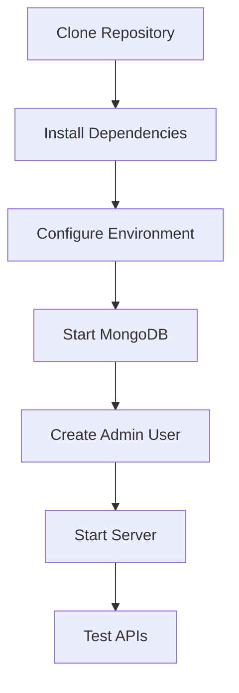
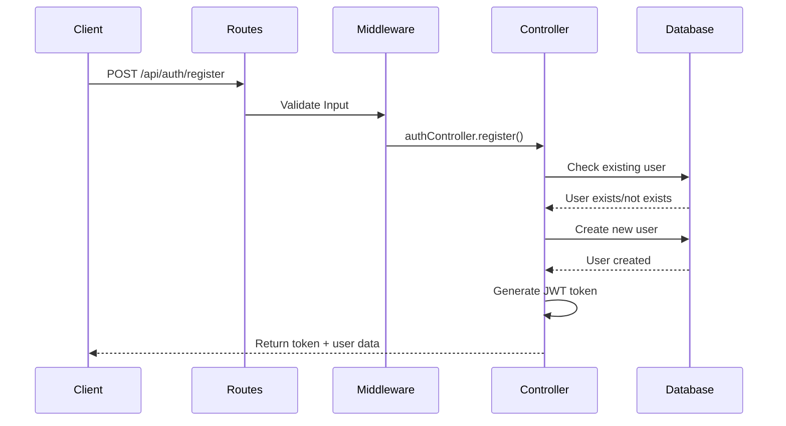
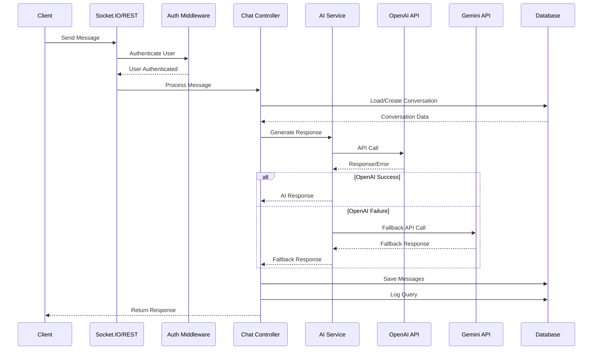
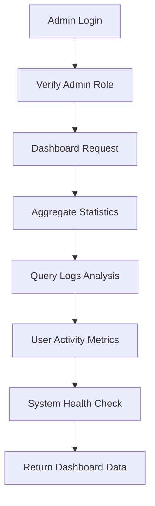
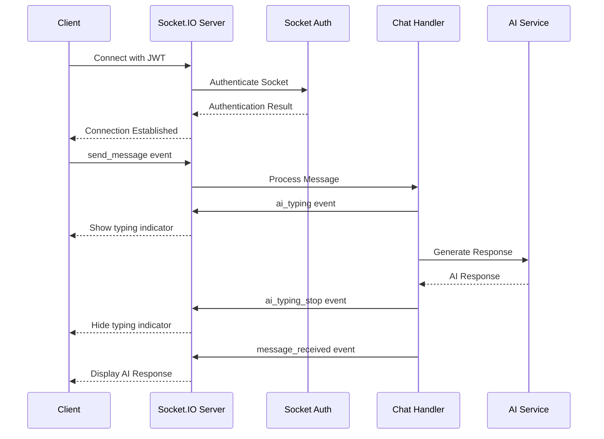
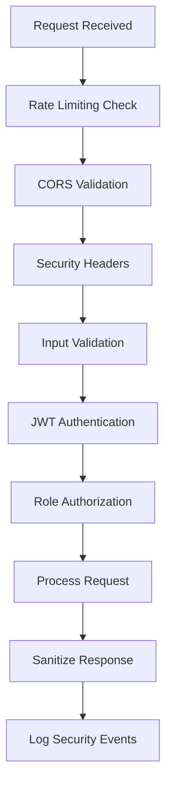
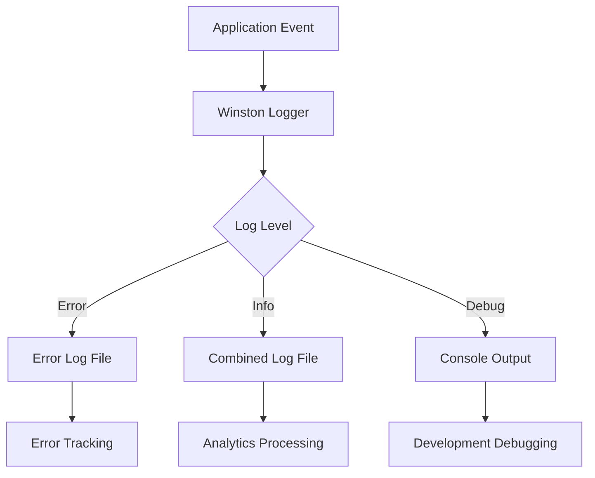
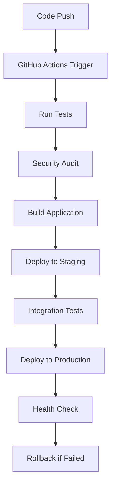

# AI Chatbot Backend - Workflow Guide

## 🔄 Complete Application Workflows

### 1. 🚀 **Project Setup Workflow**



#### Step-by-Step Setup:
1. **Clone and Install**
   ```bash
   git clone https://github.com/sirnidhi/ai-chatbot-backend.git
   cd ai-chatbot-backend
   npm install
   ```

2. **Environment Configuration**
   ```bash
   # Update .env file with:
   OPENAI_API_KEY=your-openai-key
   GEMINI_API_KEY=your-gemini-key
   MONGODB_URI=your-mongodb-connection
   ```

3. **Database Setup**
   ```bash
   # Start MongoDB service
   # Run admin creation script
   node scripts/createAdmin.js
   ```

4. **Start Application**
   ```bash
   npm run dev  # Development mode
   npm start    # Production mode
   ```

### 2. 👤 **User Authentication Workflow**



#### Authentication Steps:
1. **User Registration**
   - Validate input (username, email, password)
   - Check for existing users
   - Hash password with bcrypt
   - Save user to database
   - Generate JWT token
   - Return user data and token

2. **User Login**
   - Validate credentials
   - Compare password hash
   - Update last login timestamp
   - Generate new JWT token
   - Return authentication response

3. **Protected Route Access**
   - Extract JWT from Authorization header
   - Verify token signature
   - Check token expiration
   - Load user from database
   - Attach user to request object

### 3. 💬 **Chat Message Workflow**



#### Chat Process Steps:
1. **Message Reception**
   - Receive user message via REST API or Socket.IO
   - Authenticate user token
   - Validate message content

2. **Conversation Management**
   - Load existing conversation or create new one
   - Add user message to conversation
   - Generate conversation title if new

3. **AI Processing**
   - Format conversation for AI provider
   - Call primary AI service (OpenAI/Gemini)
   - Handle fallback to secondary provider if needed
   - Process AI response and extract content

4. **Data Storage**
   - Save AI response to conversation
   - Update token usage statistics
   - Log query details for admin monitoring
   - Update conversation metadata

5. **Response Delivery**
   - Return formatted response to client
   - Include metadata (tokens, response time, provider)
   - Emit real-time updates via Socket.IO

### 4. 🔧 **Admin Dashboard Workflow**



#### Admin Operations:
1. **Dashboard Statistics**
   - Count total users and active users
   - Calculate conversation metrics
   - Analyze AI provider usage
   - Generate error rate statistics

2. **Query Log Management**
   - Filter logs by date, provider, status
   - Export query data for analysis
   - Monitor AI response times
   - Track token usage and costs

3. **User Management**
   - View user list with search
   - Monitor user activity patterns
   - Enable/disable user accounts
   - Analyze user engagement metrics

4. **System Monitoring**
   - Check AI provider health
   - Monitor database connectivity
   - Track system resource usage
   - Generate uptime reports

### 5. 🔌 **Real-time Socket.IO Workflow**



#### Socket.IO Features:
1. **Connection Management**
   - JWT-based socket authentication
   - User room assignment
   - Connection state tracking

2. **Real-time Messaging**
   - Instant message delivery
   - Typing indicators
   - Message status updates

3. **Room Management**
   - Conversation-based rooms
   - User presence tracking
   - Broadcast capabilities

### 6. 🛡️ **Security Workflow**



#### Security Measures:
1. **Request Security**
   - Rate limiting per IP
   - CORS policy enforcement
   - Security headers (Helmet.js)
   - Input validation and sanitization

2. **Authentication Security**
   - JWT token validation
   - Token expiration checks
   - Role-based access control
   - Session management

3. **Data Security**
   - Password hashing (bcrypt)
   - Sensitive data encryption
   - SQL injection prevention
   - XSS protection

### 7. 📊 **Monitoring and Logging Workflow**



#### Logging Strategy:
1. **Application Logging**
   - Request/response logging
   - Error tracking and stack traces
   - Performance metrics
   - User activity logs

2. **AI Usage Monitoring**
   - Token consumption tracking
   - Response time analysis
   - Provider success rates
   - Cost calculation

3. **System Health Monitoring**
   - Database connection status
   - Memory and CPU usage
   - API endpoint availability
   - Error rate monitoring

### 8. 🚀 **Deployment Workflow**



#### CI/CD Pipeline:
1. **Continuous Integration**
   - Automated testing on push
   - Code quality checks
   - Security vulnerability scanning
   - Dependency auditing

2. **Continuous Deployment**
   - Staging environment deployment
   - Integration testing
   - Production deployment
   - Health monitoring

3. **Rollback Strategy**
   - Automated rollback on failure
   - Database migration handling
   - Zero-downtime deployment
   - Monitoring and alerting

This comprehensive workflow guide ensures smooth operation and maintenance of the AI Chatbot Backend system.